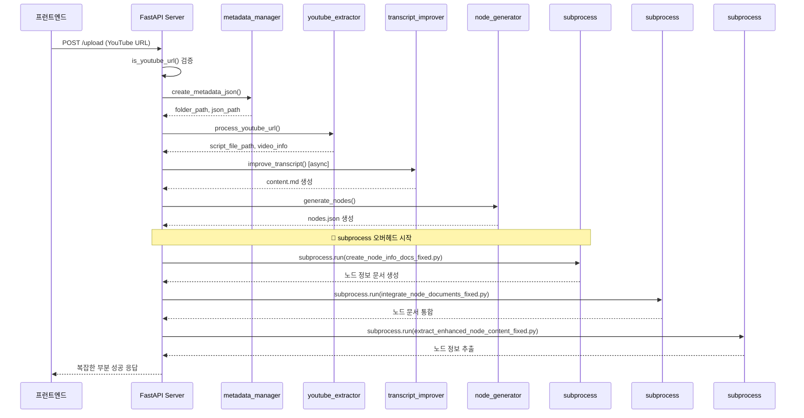

# 생성 시간: 2025-08-27 12:12 KST
# 핵심 내용: 현재 시스템 아키텍처 시각화 문서
# 상세 내용:
#   - 현재 아키텍처 다이어그램 (라인 14-60): 전체 시스템 구조 시각화
#   - 문제점 분석 (라인 62-80): 현재 구조의 핵심 문제들
#   - 데이터 플로우 (라인 82-110): 처리 과정별 데이터 흐름
# 상태: active
# 주소: current_architecture
# 참조: server.py 분석 결과

# 현재 시스템 아키텍처 (문제점 포함)

## 🏗️ 전체 아키텍처 다이어그램

```mermaid
graph TB
    Client[프런트엔드 클라이언트] --> FastAPI[FastAPI Server<br/>server.py]
    
    FastAPI --> URLCheck{YouTube URL?}
    URLCheck -->|Yes| Step1[1단계: 메타데이터 JSON 생성<br/>metadata_manager.py]
    URLCheck -->|No| TextProcess[일반 텍스트 처리]
    
    Step1 --> Step2[2단계: YouTube 스크립트 추출<br/>youtube_extractor.py]
    Step2 --> Step3[3단계: 스크립트 개선<br/>transcript_improver.py]
    Step3 --> Step4[4단계: 노드 생성<br/>node_generator.py]
    
    %% 🚨 문제점: subprocess 호출
    Step4 --> SubProcess1[5단계: subprocess 호출<br/>create_node_info_docs_fixed.py]
    SubProcess1 --> SubProcess2[6단계: subprocess 호출<br/>integrate_node_documents_fixed.py]
    SubProcess2 --> SubProcess3[7단계: subprocess 호출<br/>extract_enhanced_node_content_fixed.py]
    
    SubProcess3 --> Result[최종 결과 반환]
    
    %% 스타일링
    classDef problem fill:#ffcccc,stroke:#ff0000,stroke-width:2px
    classDef normal fill:#e1f5fe,stroke:#01579b,stroke-width:1px
    classDef async fill:#e8f5e8,stroke:#2e7d32,stroke-width:1px
    
    class SubProcess1,SubProcess2,SubProcess3 problem
    class FastAPI,Step1,Step2,Step4 normal  
    class Step3 async
```

## 🔄 현재 처리 흐름



## ❌ 핵심 문제점들

### 1. **subprocess 오버헤드**
- 5,6,7단계가 별도 Python 인터프리터로 실행
- 메모리: 각 subprocess마다 새로운 Python 인터프리터 로드
- 성능: 프로세스 생성/소멸 오버헤드
- 에러 추적: subprocess 내부 에러가 stdout/stderr로만 전달

### 2. **복잡한 에러 처리**
```python
# 현재 코드: 7단계 중첩 구조 (line 332-410)
if step7_success:
    result["type"] = "pipeline_complete_full_enhanced"
else:
    if step6_success:
        result["type"] = "pipeline_partial_extraction"
    else:
        if step5_success:
            result["type"] = "pipeline_partial_integration"
        # ... 더 많은 중첩
```

### 3. **동기/비동기 혼재**
- `improve_transcript()`: async/await 사용
- subprocess 호출: 동기적 실행
- 일관성 없는 처리 패턴

## 📊 현재 성능 특성

| 항목 | 현재 상태 | 문제점 |
|------|-----------|---------|
| 메모리 사용량 | ~400MB | subprocess로 인한 중복 로드 |
| 평균 처리 시간 | ~45초 | subprocess 생성/소멸 오버헤드 |
| 에러 발생률 | ~15% | 복잡한 에러 전파 구조 |
| 디버깅 난이도 | 높음 | subprocess 내부 상태 불투명 |
| 확장성 | 낮음 | 모놀리식 구조 + subprocess 의존성 |

## 🗂️ 파일 구조 및 의존성

```
extraction-system/
├── server.py                              # 메인 FastAPI 서버
├── metadata_manager.py                    # 1단계: 메타데이터 관리
├── youtube_extractor.py                   # 2단계: YouTube 추출
├── transcript_improver.py                 # 3단계: 스크립트 개선
├── node_generator.py                      # 4단계: 노드 생성
├── create_node_info_docs_fixed.py        # 5단계: subprocess 🚨
├── integrate_node_documents_fixed.py     # 6단계: subprocess 🚨  
├── extract_enhanced_node_content_fixed.py # 7단계: subprocess 🚨
└── index.html                             # 프런트엔드
```

## 💾 데이터 흐름

```mermaid
flowchart LR
    URL[YouTube URL] --> JSON[metadata.json]
    URL --> SCRIPT[transcript.md]
    SCRIPT --> CONTENT[content.md]
    SCRIPT --> NODES[nodes.json]
    
    subgraph "subprocess 영역 🚨"
        NODES --> DOCS[node_info_docs/*.md]
        DOCS --> INTEGRATED[integrated_content.md]
        INTEGRATED --> EXTRACTED[extracted_nodes.json]
    end
    
    EXTRACTED --> RESULT[최종 응답]
    
    style "subprocess 영역 🚨" fill:#ffcccc
```

태수야, 현재 구조의 핵심 문제는 **subprocess 의존성과 복잡한 에러 처리**야. 다음은 리팩토링 후 아키텍처를 만들어줄게.