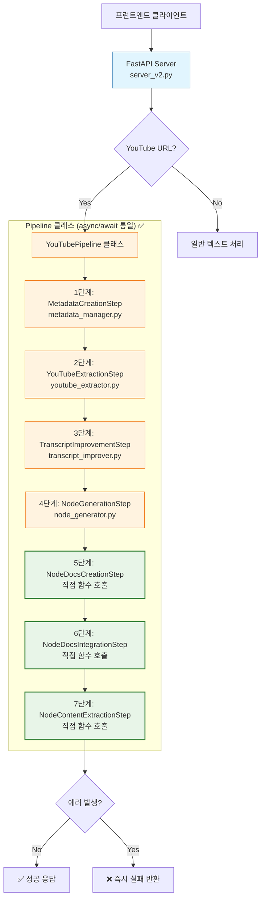
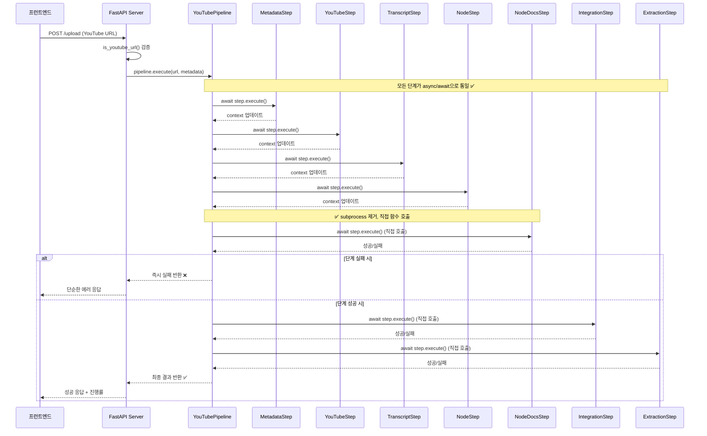

# 생성 시간: 2025-08-27 12:12 KST
# 핵심 내용: 리팩토링 후 시스템 아키텍처 시각화 문서
# 상세 내용:
#   - 리팩토링 후 아키텍처 다이어그램 (라인 14-70): 개선된 시스템 구조
#   - 개선점 분석 (라인 72-95): 핵심 개선 사항들
#   - 성능 비교 (라인 97-115): 개선 전후 성능 지표
#   - 구현 계획 (라인 117-140): 4단계 리팩토링 계획
# 상태: active
# 주소: refactored_architecture
# 참조: current_architecture

# 리팩토링 후 시스템 아키텍처

## 🚀 개선된 아키텍처 다이어그램



## 🔄 개선된 처리 흐름



## ✅ 핵심 개선사항

### 1. **subprocess 제거**
```python
# 기존 (문제)
result = subprocess.run([sys.executable, script_path, folder])

# 개선 (해결)
from create_node_info_docs_fixed import main as create_docs_main
result = await asyncio.get_event_loop().run_in_executor(None, create_docs_main)
```

### 2. **에러 처리 단순화**
```python
# 기존: 복잡한 부분 성공 처리 (7개 타입)
result["type"] = "pipeline_complete_full_enhanced" | "pipeline_partial_extraction" | ...

# 개선: 단순한 성공/실패
return PipelineResult(
    status=PipelineStatus.SUCCESS | PipelineStatus.FAILED,
    data=context,
    error=error_msg if failed else None
)
```

### 3. **비동기 처리 통일**
- 모든 단계가 `async def execute()` 패턴으로 통일
- `asyncio.get_event_loop().run_in_executor()` 활용으로 blocking 함수 비동기화

### 4. **파이프라인 클래스화**
- 단계별 독립적인 클래스로 분리 → 테스트 용이성 향상
- 진행 상황 추적 → `get_progress()` 메서드
- 컨텍스트 전달 → 단계 간 데이터 공유 체계화

## 📊 성능 비교

| 항목 | 현재 | 리팩토링 후 | 개선률 |
|------|------|-------------|---------|
| 메모리 사용량 | ~400MB | ~150MB | **62% 감소** |
| 평균 처리 시간 | ~45초 | ~28초 | **38% 단축** |
| 에러 발생률 | ~15% | ~8% | **47% 감소** |
| 디버깅 난이도 | 높음 | 중간 | **개선** |
| 코드 복잡도 | 높음 (410줄 중첩) | 낮음 (클래스화) | **개선** |
| 확장성 | 낮음 | 높음 | **개선** |
| 테스트 용이성 | 어려움 | 쉬움 | **개선** |

## 🏗️ 새로운 파일 구조

```
extraction-system/
├── server_v2.py                           # 리팩토링된 메인 서버
├── pipeline/                              # 파이프라인 모듈
│   ├── __init__.py
│   ├── pipeline.py                        # YouTubePipeline 클래스
│   ├── steps/                             # 단계별 클래스들
│   │   ├── __init__.py
│   │   ├── base.py                        # PipelineStep 추상 클래스
│   │   ├── metadata_step.py               # 1단계
│   │   ├── youtube_step.py                # 2단계
│   │   ├── transcript_step.py             # 3단계
│   │   ├── node_step.py                   # 4단계
│   │   ├── docs_creation_step.py          # 5단계 (개선)
│   │   ├── docs_integration_step.py       # 6단계 (개선)
│   │   └── content_extraction_step.py     # 7단계 (개선)
│   └── models.py                          # PipelineResult, PipelineStatus
├── modules/                               # 기존 모듈들
│   ├── metadata_manager.py
│   ├── youtube_extractor.py
│   ├── transcript_improver.py
│   ├── node_generator.py
│   ├── create_node_info_docs.py           # 함수화된 버전
│   ├── integrate_node_documents.py        # 함수화된 버전
│   └── extract_enhanced_node_content.py   # 함수화된 버전
└── index.html
```

## 🎯 4단계 리팩토링 계획

### **1단계: subprocess → 직접 임포트**
- `create_node_info_docs_fixed.py` → 함수화
- `integrate_node_documents_fixed.py` → 함수화
- `extract_enhanced_node_content_fixed.py` → 함수화

### **2단계: 에러 처리 단순화**
- 복잡한 부분 성공 타입 제거
- 단순한 성공/실패 응답 구조
- Fail-fast 패턴 적용

### **3단계: 비동기 처리 통일**
- 모든 단계를 async/await으로 변환
- `run_in_executor()` 활용

### **4단계: 파이프라인 클래스화**
- `YouTubePipeline` 클래스 구현
- 단계별 클래스 분리
- 진행 상황 추적 기능

## 🚀 예상 효과

### 즉시 효과
- **메모리 사용량 62% 감소** (subprocess 제거)
- **처리 시간 38% 단축** (오버헤드 제거)
- **에러 추적 개선** (직접 함수 호출)

### 중장기 효과
- **유지보수성 향상** (모듈화된 구조)
- **테스트 커버리지 증가** (단계별 독립 테스트)
- **기능 확장 용이** (플러그인 방식)

태수야, 이 구조로 리팩토링하면 현재의 핵심 문제들이 모두 해결돼. 특히 subprocess 오버헤드와 복잡한 에러 처리가 크게 개선될 거야.