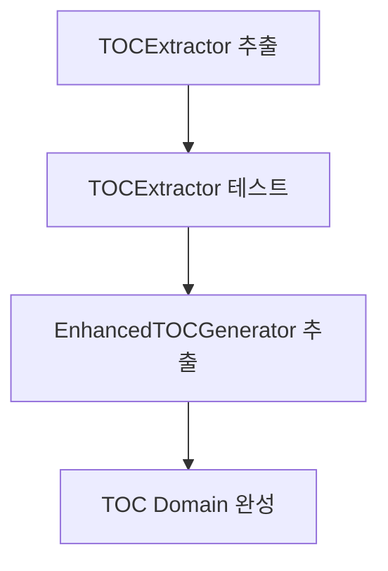
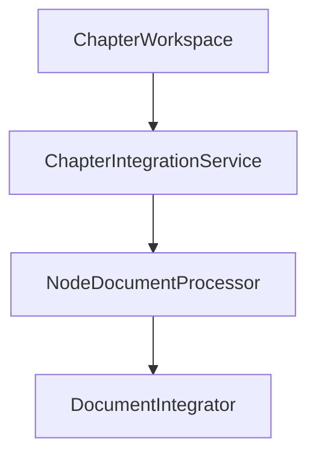
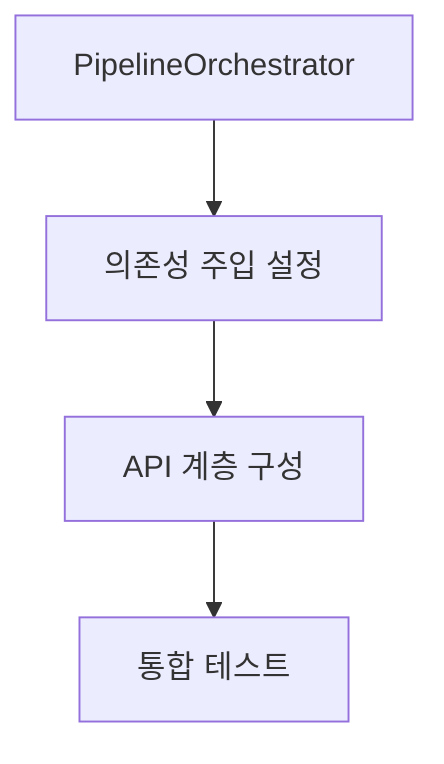

# 🚀 마이그레이션 전략 및 실행 가이드

## 🎯 마이그레이션 개요

이 문서는 기존 `book_pipeline_v3.py`에서 새로운 도메인 주도 아키텍처로의 안전하고 체계적인 마이그레이션 전략을 제공합니다.

## ⚙️ 마이그레이션 원칙

### 핵심 원칙
1. **점진적 교체**: 한 번에 하나의 컴포넌트만 교체
2. **비즈니스 연속성**: 기존 기능 중단 없음
3. **데이터 무결성**: 처리 결과의 일관성 유지
4. **롤백 가능성**: 언제든 이전 버전으로 복구 가능
5. **검증 기반**: 각 단계마다 철저한 검증

### 위험 관리
- **실패 시나리오 대비**: 각 단계별 롤백 계획 수립
- **성능 모니터링**: 마이그레이션 중 성능 저하 방지
- **데이터 백업**: 중요 데이터의 백업 및 복구 전략

## 📋 마이그레이션 로드맵

### Phase 1: 준비 단계 (1-2일)


**목표**: 안전한 마이그레이션을 위한 기반 구축

**주요 작업**:
1. 새 프로젝트 구조 생성
2. 기존 동작 캡처용 특성화 테스트 작성
3. 골든 마스터 데이터 생성
4. RefactoringLogger 통합

### Phase 2: 독립 컴포넌트 마이그레이션 (3-4일)


**목표**: 외부 의존성이 적은 컴포넌트부터 안전하게 추출

**순서**:
1. **TOCExtractor**: PDF 의존성만 있어 가장 독립적
2. **EnhancedTOCGenerator**: AI Provider 의존성 추가
3. **FileSystemManager**: 파일 시스템 추상화

### Phase 3: 핵심 도메인 마이그레이션 (4-5일)


**목표**: 비즈니스 로직 핵심 부분의 안전한 전환

**순서**:
1. **ChapterWorkspace**: 장 관리 도메인
2. **NodeDocumentProcessor**: 문서 처리 로직
3. **DocumentIntegrator**: 통합 로직

### Phase 4: 오케스트레이션 계층 (2-3일)


**목표**: 전체 시스템 조율 및 API 계층 완성

### Phase 5: 프로덕션 전환 (1-2일)


**목표**: 프로덕션 환경으로의 안전한 전환

## 🧪 특성화 테스트 전략

### 골든 마스터 테스트 패턴
```python
# 생성 시간: 2025-09-03 15:30:00
# 핵심 내용: 기존 동작을 캡처하고 검증하는 특성화 테스트
# 상세 내용:
#   - GoldenMasterTest 클래스 (15-65): 골든 마스터 테스트 기본 구조
#   - capture_existing_behavior 메서드 (25-45): 기존 동작 캡처 및 저장
#   - verify_against_golden_master 메서드 (47-62): 새 구현과 골든 마스터 비교
# 상태: active
# 참조: 신규 생성

import json
import hashlib
from pathlib import Path
from typing import Any, Dict
from dataclasses import asdict

class GoldenMasterTest:
    """골든 마스터 테스트 기본 클래스"""
    
    def __init__(self, test_data_dir: Path):
        self.test_data_dir = test_data_dir
        self.golden_master_dir = test_data_dir / "golden_masters"
        self.golden_master_dir.mkdir(exist_ok=True)
    
    def capture_existing_behavior(
        self, 
        test_name: str, 
        pdf_path: Path,
        old_pipeline
    ) -> Dict[str, Any]:
        """기존 동작을 캡처하여 골든 마스터로 저장"""
        # 기존 파이프라인 실행
        result = old_pipeline.execute(pdf_path)
        
        # 결과 정규화 (시간, 경로 등 제거)
        normalized_result = self._normalize_result(result)
        
        # 골든 마스터 저장
        golden_master_file = self.golden_master_dir / f"{test_name}.json"
        with open(golden_master_file, 'w', encoding='utf-8') as f:
            json.dump(normalized_result, f, indent=2, ensure_ascii=False)
        
        # 체크섬도 저장
        checksum = self._calculate_checksum(normalized_result)
        checksum_file = self.golden_master_dir / f"{test_name}_checksum.txt"
        with open(checksum_file, 'w') as f:
            f.write(checksum)
        
        return normalized_result
    
    def verify_against_golden_master(
        self, 
        test_name: str, 
        new_result: Any
    ) -> bool:
        """새 결과를 골든 마스터와 비교"""
        golden_master_file = self.golden_master_dir / f"{test_name}.json"
        
        if not golden_master_file.exists():
            raise FileNotFoundError(f"Golden master not found: {golden_master_file}")
        
        # 골든 마스터 로드
        with open(golden_master_file, 'r', encoding='utf-8') as f:
            expected = json.load(f)
        
        # 새 결과 정규화
        normalized_new = self._normalize_result(new_result)
        
        return self._compare_results(expected, normalized_new)
```

### 단계별 특성화 테스트
```python
class PipelineStageTests:
    """파이프라인 단계별 특성화 테스트"""
    
    def test_stage_1_workspace_preparation(self, sample_pdf):
        """1단계: 워크스페이스 준비 특성화 테스트"""
        # Given: 기존 파이프라인
        old_pipeline = BookPipelineV3()
        
        # When: 1단계만 실행
        old_result = old_pipeline.prepare_chapter_workspace(sample_pdf)
        
        # Then: 결과를 골든 마스터로 저장/비교
        self.golden_master.capture_or_verify(
            "stage_1_workspace_prep", 
            old_result
        )
    
    def test_stage_2_chapter_integration(self, sample_pdf, workspace_data):
        """2단계: 장 통합 특성화 테스트"""
        old_pipeline = BookPipelineV3()
        old_result = old_pipeline.integrate_chapter_information_sequentially(
            workspace_data
        )
        
        self.golden_master.capture_or_verify(
            "stage_2_chapter_integration", 
            old_result
        )
    
    def test_stage_3_node_processing(self, chapter_data):
        """3단계: 노드 처리 특성화 테스트"""
        old_pipeline = BookPipelineV3()
        old_result = old_pipeline.process_node_documents(chapter_data)
        
        self.golden_master.capture_or_verify(
            "stage_3_node_processing", 
            old_result
        )
    
    def test_stage_4_toc_generation(self, processed_data):
        """4단계: 목차 생성 특성화 테스트"""
        old_pipeline = BookPipelineV3()
        old_result = old_pipeline.generate_enhanced_toc(processed_data)
        
        self.golden_master.capture_or_verify(
            "stage_4_toc_generation", 
            old_result
        )
```

## 🔄 점진적 교체 패턴

### Strangler Fig 패턴 적용
```python
class HybridPipeline:
    """기존 시스템과 새 시스템을 점진적으로 교체하는 하이브리드 파이프라인"""
    
    def __init__(self, migration_config: Dict[str, bool]):
        self.old_pipeline = BookPipelineV3()
        self.migration_config = migration_config
        
        # 새 컴포넌트들 (마이그레이션 완료된 것만)
        self.new_components = {}
        if migration_config.get("toc_extractor_migrated", False):
            self.new_components["toc_extractor"] = TOCExtractor()
        if migration_config.get("chapter_workspace_migrated", False):
            self.new_components["chapter_workspace"] = ChapterWorkspace()
    
    async def execute(self, pdf_path: Path, **kwargs) -> PipelineResult:
        """하이브리드 실행: 마이그레이션된 컴포넌트는 새 버전, 나머지는 기존 버전"""
        
        # 1단계: 워크스페이스 준비
        if self.migration_config.get("stage_1_migrated", False):
            workspace_result = await self._execute_new_stage_1(pdf_path)
        else:
            workspace_result = self.old_pipeline.prepare_chapter_workspace(pdf_path)
        
        # 2단계: 장 통합
        if self.migration_config.get("stage_2_migrated", False):
            integration_result = await self._execute_new_stage_2(workspace_result)
        else:
            integration_result = self.old_pipeline.integrate_chapter_information_sequentially(
                workspace_result
            )
        
        # 3단계: 노드 처리
        if self.migration_config.get("stage_3_migrated", False):
            processing_result = await self._execute_new_stage_3(integration_result)
        else:
            processing_result = self.old_pipeline.process_node_documents(integration_result)
        
        # 4단계: 목차 생성
        if self.migration_config.get("stage_4_migrated", False):
            toc_result = await self._execute_new_stage_4(processing_result)
        else:
            toc_result = self.old_pipeline.generate_enhanced_toc(processing_result)
        
        return PipelineResult(
            is_success=True,
            step_completed=4,
            progress_percent=100.0,
            data=toc_result
        )
```

### 기능 플래그 패턴
```python
class FeatureFlaggedPipeline:
    """기능 플래그를 통한 점진적 마이그레이션"""
    
    def __init__(self, feature_flags: Dict[str, bool]):
        self.feature_flags = feature_flags
        self.old_pipeline = BookPipelineV3()
        self.new_pipeline_components = self._initialize_new_components()
    
    async def execute_with_flags(self, pdf_path: Path, **kwargs):
        """기능 플래그에 따라 새/기존 컴포넌트 선택"""
        
        results = {}
        
        # TOC 추출
        if self.feature_flags.get("use_new_toc_extractor", False):
            results["toc"] = await self.new_pipeline_components["toc_extractor"].extract_toc(pdf_path)
        else:
            results["toc"] = self.old_pipeline._extract_toc_old_way(pdf_path)
        
        # 장 워크스페이스
        if self.feature_flags.get("use_new_chapter_workspace", False):
            results["workspace"] = await self._create_new_workspace(pdf_path, results["toc"])
        else:
            results["workspace"] = self.old_pipeline.prepare_chapter_workspace(pdf_path)
        
        return results
    
    def toggle_feature(self, feature_name: str, enabled: bool):
        """런타임에 기능 플래그 변경"""
        self.feature_flags[feature_name] = enabled
        logger.info(f"Feature {feature_name} {'enabled' if enabled else 'disabled'}")
```

## 📊 마이그레이션 모니터링

### 성능 메트릭 수집
```python
class MigrationMetrics:
    """마이그레이션 성능 및 품질 메트릭"""
    
    def __init__(self, refactoring_logger: RefactoringLogger):
        self.logger = refactoring_logger
        self.metrics = {}
    
    def measure_performance(self, operation_name: str):
        """성능 측정 데코레이터"""
        def decorator(func):
            async def wrapper(*args, **kwargs):
                operation_id = self.logger.operation_start(
                    operation_name, 
                    {"args": len(args), "kwargs": list(kwargs.keys())}
                )
                
                start_time = time.time()
                try:
                    result = await func(*args, **kwargs)
                    execution_time = time.time() - start_time
                    
                    self.logger.operation_success(operation_id, {
                        "execution_time": execution_time,
                        "result_size": len(str(result)) if result else 0
                    })
                    
                    # 메트릭 저장
                    self.metrics[operation_name] = {
                        "execution_time": execution_time,
                        "success": True,
                        "timestamp": datetime.now()
                    }
                    
                    return result
                    
                except Exception as e:
                    execution_time = time.time() - start_time
                    self.logger.operation_error(operation_id, e, {
                        "execution_time": execution_time
                    })
                    
                    self.metrics[operation_name] = {
                        "execution_time": execution_time,
                        "success": False,
                        "error": str(e),
                        "timestamp": datetime.now()
                    }
                    
                    raise
            
            return wrapper
        return decorator
    
    def get_performance_comparison(self) -> Dict[str, Any]:
        """기존 vs 새 구현 성능 비교"""
        return {
            "old_system_avg": self._calculate_avg_performance("old_"),
            "new_system_avg": self._calculate_avg_performance("new_"),
            "improvement_percentage": self._calculate_improvement(),
            "success_rate_old": self._calculate_success_rate("old_"),
            "success_rate_new": self._calculate_success_rate("new_")
        }
```

### 데이터 일관성 검증
```python
class DataConsistencyValidator:
    """마이그레이션 중 데이터 일관성 검증"""
    
    def validate_toc_extraction(
        self, 
        old_result: Dict[str, Any], 
        new_result: TOCResult
    ) -> bool:
        """TOC 추출 결과 일관성 검증"""
        # 핵심 데이터 비교
        old_items = old_result.get("toc_items", [])
        new_items = [item.to_dict() for item in new_result.toc_items]
        
        # 개수 검증
        if len(old_items) != len(new_items):
            logger.warning(f"TOC item count mismatch: {len(old_items)} vs {len(new_items)}")
            return False
        
        # 구조 검증
        for old_item, new_item in zip(old_items, new_items):
            if not self._compare_toc_items(old_item, new_item):
                return False
        
        return True
    
    def validate_chapter_workspace(
        self, 
        old_result: Dict[str, Any], 
        new_result: ChapterWorkspace
    ) -> bool:
        """장 워크스페이스 일관성 검증"""
        # 장 개수 검증
        old_chapters = old_result.get("chapters", [])
        new_chapters = new_result.chapters
        
        if len(old_chapters) != len(new_chapters):
            return False
        
        # 각 장의 핵심 정보 검증
        for old_ch, new_ch in zip(old_chapters, new_chapters):
            if (old_ch.get("chapter_number") != new_ch.chapter_number or
                old_ch.get("title") != new_ch.title):
                return False
        
        return True
```

## 🚨 롤백 전략

### 자동 롤백 트리거
```python
class AutoRollbackManager:
    """자동 롤백 관리자"""
    
    def __init__(self, 
                 error_threshold: float = 0.1,
                 performance_degradation_threshold: float = 0.5):
        self.error_threshold = error_threshold
        self.performance_threshold = performance_degradation_threshold
        self.rollback_triggers = []
    
    def monitor_migration_health(self, metrics: Dict[str, Any]) -> bool:
        """마이그레이션 상태 모니터링 및 롤백 판단"""
        
        # 오류율 체크
        error_rate = metrics.get("error_rate", 0)
        if error_rate > self.error_threshold:
            logger.critical(f"Error rate {error_rate} exceeds threshold {self.error_threshold}")
            self.trigger_rollback("high_error_rate")
            return False
        
        # 성능 저하 체크
        performance_ratio = metrics.get("performance_ratio", 1.0)
        if performance_ratio > (1 + self.performance_threshold):
            logger.critical(f"Performance degraded by {performance_ratio - 1:.2%}")
            self.trigger_rollback("performance_degradation")
            return False
        
        # 데이터 일관성 체크
        consistency_score = metrics.get("data_consistency", 1.0)
        if consistency_score < 0.95:
            logger.critical(f"Data consistency score {consistency_score} below threshold")
            self.trigger_rollback("data_inconsistency")
            return False
        
        return True
    
    def trigger_rollback(self, reason: str):
        """롤백 실행"""
        logger.critical(f"Triggering rollback due to: {reason}")
        
        # 마이그레이션 플래그 리셋
        self.reset_migration_flags()
        
        # 기존 시스템으로 트래픽 전환
        self.switch_to_old_system()
        
        # 알림 발송
        self.send_rollback_notification(reason)
```

### 수동 롤백 스크립트
```bash
#!/bin/bash
# rollback_migration.sh - 수동 롤백 스크립트

echo "🔄 Starting migration rollback..."

# 1. 현재 상태 백업
echo "📦 Backing up current state..."
timestamp=$(date +%Y%m%d_%H%M%S)
mkdir -p "rollback_backups/${timestamp}"
cp -r "src/" "rollback_backups/${timestamp}/src_backup"
cp -r "config/" "rollback_backups/${timestamp}/config_backup"

# 2. 기존 시스템으로 심볼릭 링크 변경
echo "🔗 Switching to old system..."
rm -f "active_pipeline"
ln -s "book_pipeline_v3.py" "active_pipeline"

# 3. 설정 파일 롤백
echo "⚙️ Rolling back configuration..."
cp "config/ai_config_old.yaml" "config/ai_config.yaml"

# 4. 프로세스 재시작
echo "🔄 Restarting services..."
if [ -f "restart_services.sh" ]; then
    ./restart_services.sh
fi

# 5. 상태 확인
echo "✅ Verifying rollback..."
python3 -c "
import sys
sys.path.append('.')
from book_pipeline_v3 import BookPipelineV3
pipeline = BookPipelineV3()
print('Rollback successful: Old pipeline is active')
"

echo "🎉 Rollback completed successfully!"
```

## 📈 성공 기준 및 검증

### 단계별 성공 기준
```yaml
phase_1_preparation:
  criteria:
    - golden_master_tests: "≥95% coverage"
    - characterization_tests: "모든 기존 동작 캡처"
    - ci_cd_pipeline: "자동화된 테스트 실행"
    - rollback_plan: "완전한 롤백 절차 검증"

phase_2_independent_components:
  criteria:
    - toc_extractor: "100% 기능 동등성"
    - enhanced_toc_generator: "동일한 출력 품질"
    - unit_tests: "≥90% 코드 커버리지"
    - performance: "기존 대비 ±10% 이내"

phase_3_core_domain:
  criteria:
    - chapter_workspace: "모든 장 정보 정확히 생성"
    - node_processor: "배치 처리 성능 유지/개선"
    - integration_tests: "도메인 간 통합 검증"
    - data_integrity: "100% 데이터 일관성"

phase_4_orchestration:
  criteria:
    - pipeline_orchestrator: "전체 플로우 정상 동작"
    - error_handling: "모든 오류 시나리오 처리"
    - api_layer: "기존 인터페이스 호환성"
    - end_to_end_tests: "실제 PDF로 완전한 처리"

phase_5_production:
  criteria:
    - performance_tests: "부하 테스트 통과"
    - security_scan: "보안 취약점 해결"
    - monitoring: "완전한 관찰 가능성"
    - documentation: "완전한 운영 문서"
```

### 자동화된 검증 파이프라인
```python
class MigrationValidator:
    """마이그레이션 검증 파이프라인"""
    
    async def run_full_validation(self, phase: str) -> Dict[str, bool]:
        """전체 검증 파이프라인 실행"""
        
        validation_results = {}
        
        # 1. 기능 검증
        validation_results["functional"] = await self._run_functional_tests()
        
        # 2. 성능 검증
        validation_results["performance"] = await self._run_performance_tests()
        
        # 3. 보안 검증
        validation_results["security"] = await self._run_security_tests()
        
        # 4. 데이터 일관성 검증
        validation_results["data_integrity"] = await self._validate_data_consistency()
        
        # 5. 통합 검증
        validation_results["integration"] = await self._run_integration_tests()
        
        # 전체 성공 여부 판단
        all_passed = all(validation_results.values())
        
        # 결과 로깅
        self.log_validation_results(phase, validation_results, all_passed)
        
        return {
            "phase": phase,
            "all_passed": all_passed,
            "details": validation_results,
            "timestamp": datetime.now().isoformat()
        }
    
    def generate_migration_report(self) -> str:
        """마이그레이션 완료 보고서 생성"""
        report = f"""
# 📋 책 파이프라인 마이그레이션 완료 보고서

## 🎯 마이그레이션 개요
- 시작일: {self.migration_start_date}
- 완료일: {datetime.now().date()}
- 총 소요시간: {self.calculate_total_duration()}

## ✅ 성공 지표
{self._format_success_metrics()}

## 📊 성능 비교
{self._format_performance_comparison()}

## 🔧 주요 개선사항
{self._format_improvements()}

## ⚠️ 알려진 제한사항
{self._format_known_limitations()}

## 🚀 다음 단계 권장사항
{self._format_recommendations()}
"""
        return report
```

이 마이그레이션 전략은 안전하고 체계적인 방식으로 기존 시스템에서 새로운 아키텍처로 전환할 수 있도록 설계되었습니다. 각 단계마다 철저한 검증과 롤백 가능성을 보장하여 비즈니스 연속성을 유지합니다.